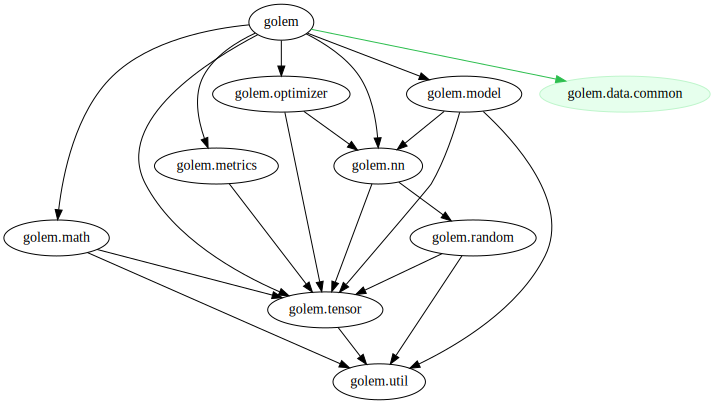

# golem


A library that provides tensors and computational graphs for machine learning.

## Concept

1. Lower the hurdle and learning curve to getting started.
2. Use language features to make model definition simple and safe.
3. Unify the code and language for training and production environments.

## Features

- A statically size checked tensor
  - with shape-safe operators
- Statically omit grads from tensor
  - `UseGradient.no` or `No.gradient`
- Some friendly error messages
- Simple `SGD` , `Adam` or `AdaBelief` optimizer

## Usage

__command__

```console
dub init
dub add golem
```

__dub.json__

```json
{
    "dependencies": {
        "golem": "~>0.8.0"
    }
}
```

__dub.sdl__

```json
dependency "golem" version="~>0.8.0"
```

### Requirements

Link with BLAS Library

See the `mir-lapack` Wiki

Link: [https://github.com/libmir/mir-lapack/wiki/Link-with-CBLAS-&-LAPACK](https://github.com/libmir/mir-lapack/wiki/Link-with-CBLAS-&-LAPACK)

__For Windows__

Use Intel MKL by default

Download : [https://software.intel.com/content/www/us/en/develop/tools/oneapi/components/onemkl.html](https://software.intel.com/content/www/us/en/develop/tools/oneapi/components/onemkl.html)

__For Ubuntu__

Use OpenBLAS by default

```console
$ sudo apt install libopenblas-dev
```

## Examples

```d
import golem;

// statically sized tensor
auto x = tensor!([2, 2])([
        [0.1, 0.2],
        [0.3, 0.4],
    ]);
auto y = tensor!([2, 2])([
        [-0.1, 0.2],
        [0.3, -0.4],
    ]);

auto z = x + y;

assert(z.value[0, 0] == 0.0);
```

```d name=no_grad
import golem;
import golem.random : randn;
import std.typecons : No;

// no grads tensor
Tensor!(float, [3, 3], UseGradient.no) x = randn!(float, [3, 3], No.gradient);
```


### Tensor Shape

```d name=shape_1
import golem;

// 3 x 2
auto x = tensor!([3, 2])([
    [1.0, 2.0],
    [3.0, 4.0],
    [5.0, 6.0],
]);
// N x 2
auto y = tensor!([0, 2])([
    [1.0, 2.0],
    [3.0, 4.0],
]);

assert(x.shape == [3, 2]);
assert(y.shape == [2, 2]);

static assert(x.staticShape == [3, 2]);
static assert(y.staticShape == [0, 2]);

assert(x.runtimeShape == [3, 2]);
assert(y.runtimeShape == [2, 2]);

const batchSize = x.shape[0];
```

```d name=shape_2
import golem;

auto x = tensor!([3, 2])([
        [1.0, 2.0],
        [3.0, 4.0],
        [5.0, 6.0],
    ]);
auto y = tensor!([2, 2])([
        [1.0, 2.0],
        [3.0, 4.0],
    ]);
auto z = tensor!([0, 2])([
        [1.0, 2.0],
        [3.0, 4.0],
    ]);

// can not compile
static assert(!__traits(compiles, {
        auto a = x + y;
    }));

// runtime error
import core.exception : AssertError;
import std.exception : assertThrown;

assertThrown!AssertError(x + z);
```

```d name=shape_3
import golem;

// more dimentions
// like PyTorch (batch, channel, width, height)
Tensor!(float, [0, 3, 224, 224]) images;

// (batch, width, height)
Tensor!(float, [0, 28, 28], UseGradient.no) mnistImages;
```

### Broadcast Operation

```d name=broadcast
import golem;
import golem.random;

Tensor!(float, [0, 28, 28]) images = randn!(float, [0, 28, 28])(1);
Tensor!(float, [28, 28]) offset = randn!(float, [28, 28]);

// shape rule for broadcast
assert(images.shape.length > offset.shape.length);
assert(images.shape[$ - offset.shape.length .. $] == offset.shape);

// broadcast
auto result1 = broadcastOp!"+"(images, offset);
auto result2 = broadcastOp!"-"(images, offset);
auto result3 = broadcastOp!"*"(images, offset);

// implement broadcast!"/"
auto result4 = broadcastOp!"*"(images, onesLike(offset) / offset);
```

### Linear

```d name=linear
import golem;

// prepare datasets with dynamic batch sizes
auto data = tensor!([0, 2])([
        [0.1, 0.2],
        [0.1, 0.3],
        [0.15, 0.4],
        [0.2, 0.5],
    ]);
auto label = tensor!([0, 1])([
        [0.4],
        [0.5],
        [0.6],
        [0.7],
    ]);

// init
auto linear = new Linear!(double, 2, 1);
auto optimizer = createOptimizer!SGD(linear);

// train
foreach (epoch; 0 .. 10_000)
{
    auto y = linear(data);
    auto diff = label - y;
    auto loss = mean(diff * diff);

    optimizer.resetGrads();
    loss.backward();
    optimizer.trainStep();
}

// result
import std.stdio;

auto y = linear(data);
writeln(y.value);
```

### Optimizer

```d name=optimizer
import golem.nn : Linear;
import golem.optimizer;

auto fc1 = new Linear!(float, 28 * 28, 100);
auto fc2 = new Linear!(float, 100, 10);

// create instance with parameters
auto sgd = createOptimizer!SGD(fc1, fc2);
auto adam = createOptimizer!Adam(fc1, fc2);

// reset grads
sgd.resetGrads();
adam.resetGrads();

// train step
sgd.trainStep();
adam.trainStep();
```

```d name=optimizer_parameters
// configure Parameters
import golem;

auto fc1 = new Linear!(float, 2, 2);
auto fc2 = new Linear!(float, 2, 1);

// SGD
auto sgd = createOptimizer!SGD(fc1, fc2);
sgd.config.learningRate = 0.1;  // default 0.01
sgd.config.momentumRate = 0.95; // default 0.9
sgd.config.weightDecay = 1e-3; // default 0

// Adam
auto adam = createOptimizer!Adam(fc1, fc2);
adam.config.learningRate = 0.1; // default 0.001
adam.config.beta1 = 0.95;       // default 0.9
adam.config.beta2 = 0.99;       // default 0.999
adam.config.eps = 1e-6;         // default 1e-8
adam.config.weightDecay = 1e-3; // default 0

// AdaBelief
// https://arxiv.org/abs/2010.07468
auto adabelief = createOptimizer!AdaBelief(fc1, fc2);
adabelief.config.learningRate = 0.1; // default 0.001
adabelief.config.beta1 = 0.95;       // default 0.9
adabelief.config.beta2 = 0.99;       // default 0.999
adabelief.config.eps = 1e-6;         // default 1e-8
adabelief.config.weightDecay = 1e-3; // default 0
```

### Custom Model

__Perceptron__

- Dim : `Input -> Hidden -> Output`
- Activation : `sigmoid`

```d name=custommodel
import golem;
import std.meta : AliasSeq;

class Perceptron(size_t Input, size_t Hidden, size_t Output)
{
    // layers
    Linear!(float, Input, Hidden) fc1;
    Linear!(float, Hidden, Output) fc2;

    // implements as a simple network module
    mixin NetModule;

    // is equals to
    /+
    alias parameters = AliasSeq!(fc1, fc2);

    this()
    {
        // init layers
        foreach (ref p; parameters)
            p = new typeof(p);
    }
    +/

    auto forward(T)(T x)
    {
        auto h = sigmoid(fc1(x));
        auto o = sigmoid(fc2(h));
        return o;
    }
}
```

__AutoEncoder__

- Dim : `10 -> 8 -> |3| -> 8 -> 10`

```d name=custommodel
class AutoEncoder
{
    // Nested custom model
    Perceptron!(10, 8, 3) encoder;
    Perceptron!(3, 8, 10) decoder;

    mixin NetModule;

    auto forward(T)(T x)
    {
        auto encoded = encode(x);
        auto decoded = decode(encoded);
        return decoded;
    }

    auto encode(T)(T x)
    {
        return encoder.forward(x);
    }

    auto decode(T)(T x)
    {
        return decoder.forward(x);
    }
}
```

#### Use Sequence

```d name=sequence
import golem;

alias Perceptron(size_t Input, size_t Hidden, size_t Output) = Sequence!(
        Linear!(float, Input, Hidden),
        Activation!sigmoid,
        Linear!(float, Hidden, Output),
        Activation!sigmoid,
    );

auto net = new Perceptron!(2, 2, 1);
auto x = tensor!([0, 2])([1.0f, 2.0f]);
auto y = net(x);
```

### K-Fold

```d name=kfold
import std.parallelism : parallel;
import golem.data.common;

auto source = [1.0, 2.0, 3.0, 4.0, 5.0];
auto datasets = source.kfold!5();

foreach (dataset; parallel(datasets[]))
{
    auto train = dataset[0];
    auto test = dataset[1];

    // train
}
```

### Save & Load

```d name=custommodel
auto model = new Perceptron!(2, 2, 1);
auto archiver = new ModelArchiver("model_data");
archiver.load(model); // recent saved parameters

foreach (epoch; 0 .. 10)
{
    // train

    archiver.save(model); // save each epoch
}
```

__filename format__

```
./model_data
    model_yyyyMMdd-hhmmss.dat
```

## Modules

__Dependency Graph__


