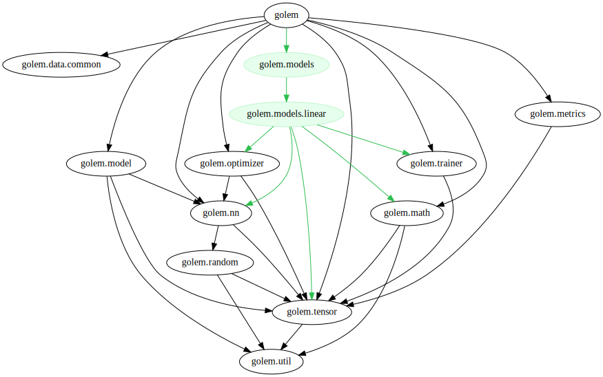

# golem


## Features

- Computational graph (autograd)
- A statically size checked slice
  - with shape-safe operators
- Statically omit grads from tensor
  - `UseGradient.no` or `No.gradient`
- Some friendly error messages
- Simple `SGD` and `Adam` optimizer

## Examples

```d
import golem;

// statically sized tensor
auto x = tensor!([2, 2])([
        [0.1, 0.2],
        [0.3, 0.4],
    ]);
auto y = tensor!([2, 2])([
        [-0.1, 0.2],
        [0.3, -0.4],
    ]);

auto z = x + y;

assert(z.value[0, 0] == 0.0);
```

```d
import golem.random : randn;

// no grads tensor
Tensor!(float, [3, 3], UseGradient.no) x = randn!(float, [3, 3], No.gradient);
```


### Tensor Shape

```d
// 3 x 2
auto x = tensor!([3, 2])(
    [1.0, 2.0],
    [3.0, 4.0],
    [5.0, 6.0],
);
// N x 2
auto y = tensor!([0, 2])([
    [1.0, 2.0],
    [3.0, 4.0],
]);

assert(x.shape == [3, 2]);
assert(y.shape == [2, 2]);

static assert(x.staticShape == [3, 2]);
static assert(y.staticShape == [0, 2]);

assert(x.runtimeShape == [3, 2]);
assert(y.runtimeShape == [2, 2]);

const batchSize = x.shape[0];
```

```d
auto x = tensor!([3, 2])(
        [1.0, 2.0],
        [3.0, 4.0],
        [5.0, 6.0],
    );
auto y = tensor!([2, 2])([
        [1.0, 2.0],
        [3.0, 4.0],
    ]);
auto z = tensor!([0, 2])([
        [1.0, 2.0],
        [3.0, 4.0],
    ]);

// can not compile
static assert(!__traits(compiles, {
        auto a = x + y;
    }));

// runtime error
assertThrown!AssertError(x + z);
```


### Linear

```d
import golem;

// prepare datasets with dynamic batch sizes
auto data = tensor!([0, 2])([
        [0.1, 0.2],
        [0.1, 0.3],
        [0.15, 0.4],
        [0.2, 0.5],
    ]);
auto label = tensor!([0, 1])([
        [0.4],
        [0.5],
        [0.6],
        [0.7],
    ]);

// init
auto linear = new Linear!(double, 2, 1);
auto optimizer = createOptimizer!SGD(linear);

// train
foreach (epoch; 0 .. 10_000)
{
    auto y = linear(data);
    auto diff = label - y;
    auto loss = mean(diff * diff);

    optimizer.resetGrads();
    loss.backward();
    optimizer.trainStep();
}

// result
auto y = linear(data);
writeln(y.value);
```

### Optimizer

```d
import golem.nn : Linear;
import golem.optimizer;

auto fc1 = new Linear!(float, 28 * 28, 100);
auto fc2 = new Linear!(float, 100, 10);

// create instance with parameters
auto sgd = createOptimizer!SGD(fc1, fc2);
auto adam = createOptimizer!Adam(fc1, fc2);

// reset grads
sgd.resetGrads();
adam.resetGrads();

// train step
sgd.trainStep();
adam.trainStep();
```

```d
// configure Parameters

auto sgd = createOptimizer!SGD(fc1, fc2);
sgd.config.learningRate = 0.1;  // default 0.01
sgd.config.momentumRate = 0.95; // default 0.9
adam.config.weightDecay = 1e-3; // default 0

auto adam = createOptimizer!Adam(fc1, fc2);
adam.config.learningRate = 0.1; // default 0.001
adam.config.beta1 = 0.95;       // default 0.9
adam.config.beta2 = 0.99;       // default 0.999
adam.config.eps = 1e-6;         // default 1e-8
adam.config.weightDecay = 1e-3; // default 0
```

### Custom Model

__Perceptron__

- Dim : `Input -> Hidden -> Output`
- Activation : `sigmoid`

```d
class Perceptron(size_t Input, size_t Hidden, size_t Output)
{
    // layers
    Linear!(float, Input, Hidden) fc1;
    Linear!(float, Hidden, Output) fc2;

    // targets of the optimization
    alias parameters = AliasSeq!(fc1, fc2);

    this()
    {
        // init layers
        foreach (ref p; parameters)
            p = new typeof(p);
    }

    auto forward(T)(T x)
    {
        auto h = sigmoid(fc1(x));
        auto o = sigmoid(fc2(h));
        return o;
    }
}
```

__AutoEncoder__

- Dim : `10 -> 8 -> |3| -> 8 -> 10`

```d
class AutoEncoder
{
    // Nested custom model
    Perceptron!(float, 10, 8, 3) encoder;
    Perceptron!(float, 3, 8, 10) decoder;

    alias parameters = AliasSeq!(encoder, decoder);

    this()
    {
        foreach (ref p; parameters)
            p = new typeof(p);
    }

    auto forward(T)(T x)
    {
        auto encoded = encode(x);
        auto decoded = decode(encoded);
        return decoded;
    }

    auto encode(T)(T x)
    {
        return encoder.forward(x);
    }

    auto decode(T)(T x)
    {
        return decoder.forward(x);
    }
}
```

#### Use Sequence

```d
alias Perceptron(size_t Input, size_t Hidden, size_t Output) = Sequence!(
        Linear!(float, Input, Hidden),
        Activation!sigmoid,
        Linear!(float, Hidden, Output),
        Activation!sigmoid,
    );

auto net = new Perceptron!(2, 2, 1);
auto x = tensor!([0, 2])([1.0f, 2.0f]);
auto y = net(x);
```

### Save & Load

```d
auto model = new Model;
auto archiver = new ModelArchiver("model_data");
archiver.load(model); // recent saved parameters

foreach (epoch; 0 .. N)
{
    // train

    archiver.save(model); // save each epoch
}
```

__filename format__

```
./model_data
    model_yyyyMMdd-hhmmss.dat
```

## Modules

__Dependency Graph__


